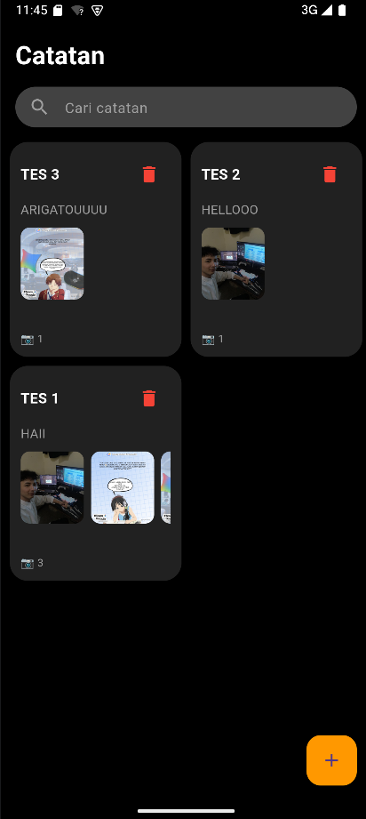
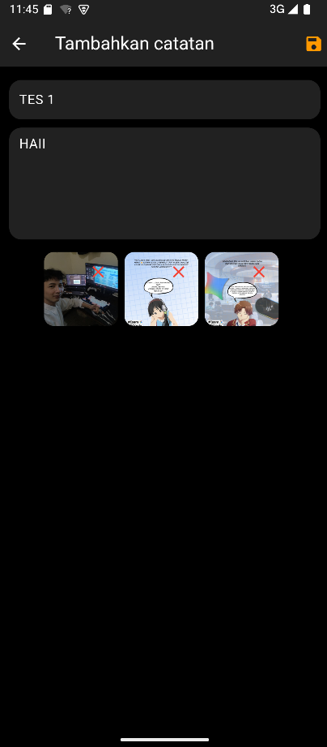
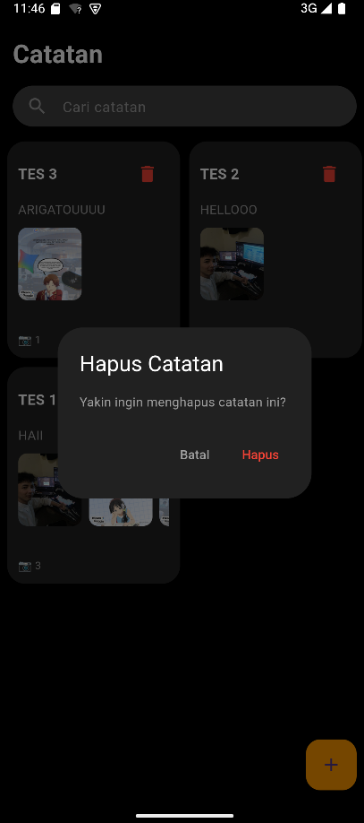

UTS Mobile Programming

Disini saya mengambil modul 4 untuk memenuhi Tugas UTS dengan membuat Aplikasi catatan sederhana berbasis Flutter yang memungkinkan pengguna membuat, menyimpan, mengedit, dan menghapus catatan menggunakan file system (dart:io), serta mendukung penambahan hingga 3 gambar pada setiap catatan.

## 🖼️ App Preview

| Home Page | Editor Page | Delete Note |
|:---------:|:-----------:|:---------:|
|  |  |  |

---

## Fitur Utama
- Menambahkan catatan (judul dan isi)
- Menyimpan data menggunakan file system (content.txt)
- Menambahkan hingga 3 gambar per catatan
- Menampilkan preview gambar pada halaman utama
- Mengedit dan menghapus catatan
- Fitur pencarian catatan berdasarkan judul dan isi

---

## Struktur Penyimpanan File
Setiap catatan disimpan dalam satu folder dengan struktur sebagai berikut:
notes/
note_xxx/
content.txt
image_1.jpg
image_2.jpg
image_3.jpg

- content.txt → menyimpan judul dan isi catatan  
- image_x.jpg → menyimpan gambar sesuai ketentuan soal  

---

## Struktur Kode (Flutter)
- lib/helpers/file_helper.dart → pengolahan file (save, read, delete)
- lib/models/note.dart → struktur data catatan
- lib/pages/note_list_screen.dart → halaman utama (homepage)
- lib/pages/edit_page.dart → halaman editor

---

## Konsep yang Digunakan
- dart:io untuk membaca dan menulis file
- writeAsString() untuk menyimpan teks
- writeAsBytes() untuk menyimpan gambar
- getApplicationDocumentsDirectory() untuk lokasi penyimpanan
- Setiap catatan disimpan dalam folder terpisah

---

## Kesesuaian dengan Soal UTS
- Soal No. 1: Penyimpanan catatan menggunakan file content.txt
- Soal No. 5: Multi image maksimal 3 gambar dengan nama image_1.jpg sampai image_3.jpg

---
